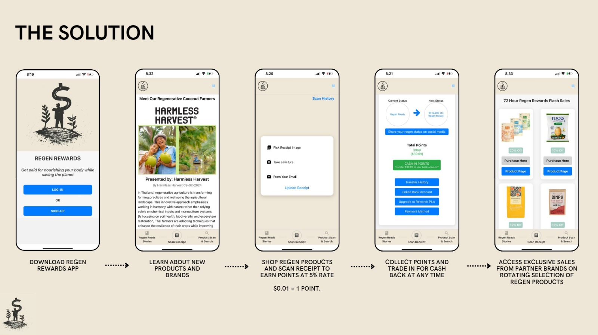

# Regen Rewards

A mobile app that rewards users for nourishing their bodies while saving the planet.

---

## 📱 Overview

**Regen Rewards** is a React Native (Expo) mobile application that allows users to:
- Sign up and log in securely
- Upload a profile image
- Track eco-friendly actions and earn rewards
- View and update their profile

---

## 🚀 Features

- User authentication (sign up, log in, log out)
- Profile management (update info, upload profile image)
- Reward tracking system
- Cross-platform: works on both iOS and Android

---

## 🛠️ Tech Stack

- **Frontend:** React Native (Expo)
- **Backend:** Node.js/Express (API endpoints)
- **Storage:** AsyncStorage (for auth tokens)
- **Image Upload:** Axios with multipart/form-data

---

## 📸 Screenshots


---

## 📝 Getting Started

### Prerequisites

- [Node.js](https://nodejs.org/)
- [Expo CLI](https://docs.expo.dev/get-started/installation/)
- [Git](https://git-scm.com/)

### Installation

1. **Clone the repo:**
   ```sh
   git clone https://github.com/YOUR_USERNAME/regen-rewards.git
   cd regen-rewards/Regen-Frontend
   ```

2. **Install dependencies:**
   ```sh
   npm install
   ```

3. **Start the Expo app:**
   ```sh
   npx expo start
   ```

4. **Run on your device:**
   - Use the Expo Go app (iOS/Android) to scan the QR code.

---

## ⚙️ Configuration

- Create a `.env` file for environment variables (API URLs, etc).
- Update the API URL in `services/authService.js` if needed.

---

## 🤝 Contributing

Pull requests are welcome! For major changes, please open an issue first to discuss what you would like to change.

---

## 📄 License

MIT

---

## 🙋‍♂️ Contact

- **Your Name:** Dawit Endaylalu
- **Email:** your.email@example.com
-**Linkedin:** [your-Linkedin-link.com](https://www.linkedin.com/in/dawit-endaylalu/)
- **Portfolio:** [your-portfolio-link.com](https://www.dawitendayalu.com/)

---

## 📹 Demo

_Add a link to a demo video or GIF here if you have one!_